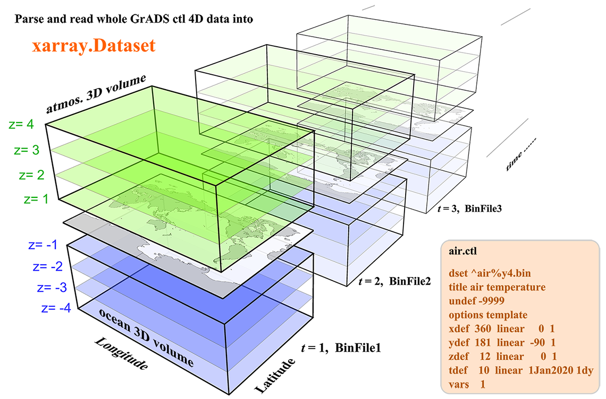

# xgrads
**Parse and read GrADS ctl and binary files into xarray**




## 1. Introduction
The Grid Analysis and Display System ([GrADS](http://cola.gmu.edu/grads/) or [OpenGrADS](http://www.opengrads.org/)) is a widely used software for easy access, manipulation, and visualization of earth science data.  It uses a descriptor (or control) file with a suffix `.ctl` to  describe a raw binary 4D dataset.  The `ctl` file is similar to the header information of a [NetCDF](https://www.unidata.ucar.edu/software/netcdf/docs/file_structure_and_performance.html) file, containing all the information about dimensions, attributes, and variables except for the variable data.

This python package [`xgrads`](https://github.com/miniufo/xgrads) is designed for parse and read the `.ctl` file commonly used by [GrADS](http://cola.gmu.edu/grads/).  Right now it can parse various kinds of `.ctl` files.  However, only the commonly used raw binary 4D datasets can be read using [`dask`](https://dask.org/) and return as a [`xarray.Dataset`](http://xarray.pydata.org/en/stable/)  Other types of binary data, like `dtype` is `station` or`grib`, may be supported in the future.

---
## 2. Examples
### 2.1 Parse a `.ctl` file
Parsing a `.ctl` file is pretty simple using the following code:
```python
from xgrads.core import CtlDescriptor

ctl = CtlDescriptor(file='test.ctl')

# print all the info in ctl file
print(ctl)
```

If you have already load the ASCII content in the `.ctl` file, you can do it as:
```python
content = \
    "dset ^binary.dat\n" \
    "* this is a comment line\n" \
    "title 10-deg resolution model\n" \
    "undef -9.99e8\n" \
    "xdef 36 linear   0 10\n" \
    "ydef 19 linear -90 10\n" \
    "zdef  1 linear   0  1\n" \
    "tdef  1 linear 00z01Jan2000 1dy\n" \
    "vars  1\n" \
    "test  1 99 test variable\n" \
    "endvars\n"

ctl = CtlDescriptor(content=content)

# print all the info
print(ctl)
```
---

### 2.2 Read binary data into a `xarray.Dataset`
Reading a `.ctl` related binary data file is also pretty simple using the following code:
```python
from xgrads.core import open_CtlDataset

dset = open_CtlDataset('test.ctl')

# print all the info in ctl file
print(dset)
```

Then you have the `dset` as a `xarray.Dataset`.  This is similar to [`xarray.open_dataset`](http://xarray.pydata.org/en/stable/generated/xarray.open_dataset.html) that use [`dask`](https://dask.org/) to chunk (buffer) parts of the whole dataset in physical memory if the whole dataset is too large to fit in.

---

### 2.3 Convert a GrADS dataset to a NetCDF dataset
With the above functionality, it is easy to convert a `.ctl` ([GrADS](http://cola.gmu.edu/grads/)) dataset to a `.nc` ([NetCDF](https://www.unidata.ucar.edu/software/netcdf/docs/file_structure_and_performance.html)) dataset:
```python
from xgrads.core import open_CtlDataset

open_CtlDataset('input.ctl').to_netcdf('output.nc')
```